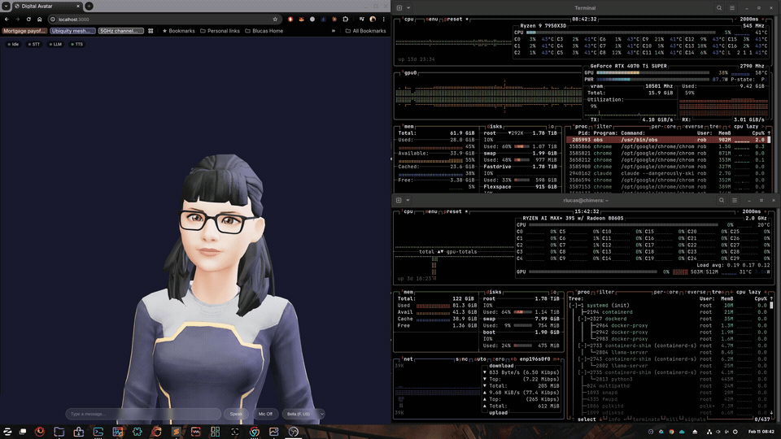
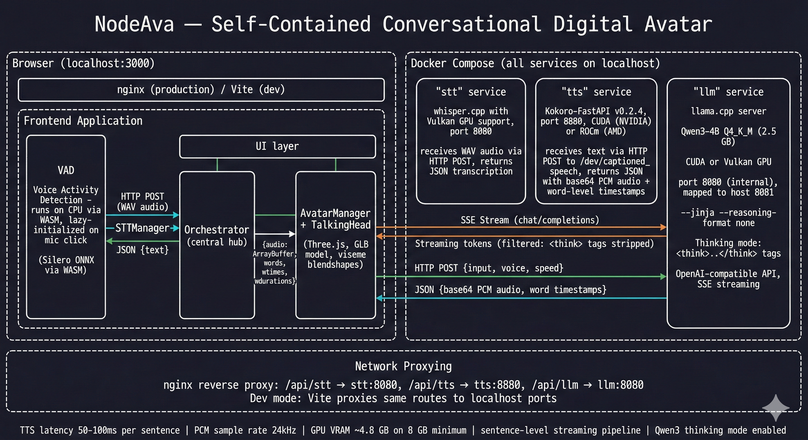

# NodeAva

A self-contained digital avatar that thinks, speaks, and listens — running entirely on your machine.



## A Quick Note

I built this for myself as a proof of concept. It's a starting point, not a polished product. I'm sharing it because it was fun to build and maybe useful to others exploring the same space. I'm not looking to heavily maintain this — fork it, break it, make it your own. Good vibes to you! :v:

## What It Does

NodeAva is a 3D talking avatar powered entirely by local AI models:

- **Thinks** before responding using a reasoning model (Qwen3-4B)
- **Speaks** with natural voice synthesis (Kokoro TTS)
- **Listens** with in-browser voice activity detection + speech-to-text (Whisper)
- **Emotes** with facial expressions and lip sync matched to speech
- **Runs locally** — no cloud APIs, no data leaves your machine

## Requirements

**Linux / Windows (Docker):**
- **GPU**: NVIDIA or AMD with **8 GB+ VRAM** (GPU is required, no CPU-only mode)
- **Docker**: Docker Engine with Compose V2
- **Disk**: ~5 GB for models + ~10 GB for Docker images (AMD: ~30 GB due to ROCm)
- **OS**: Linux or Windows (with Docker Desktop)

**macOS (Native):**
- **Apple Silicon**: M1, M2, M3, or M4 (Intel Macs not supported)
- **Memory**: 16 GB unified memory recommended (8 GB minimum)
- **macOS**: 13+ (Ventura or later)
- **Tools**: Homebrew, Python 3.10+, Node.js 18+

## Avatar

NodeAva ships with a default avatar (sourced from the [TalkingHead](https://github.com/met4citizen/TalkingHead) project). The avatar is licensed under CC BY-NC-SA 4.0 — separately from the project code. See `frontend/public/avatars/README.md` for how to swap it out or add your own.

## Prerequisites

**LLM backend — Ollama (default) _or_ LM Studio (opt-in):**
- **Ollama** (default, host install): `curl -fsSL https://ollama.com/install.sh | sh` (Linux/WSL2) or `brew install ollama` (macOS). Setup scripts pull defaults: `bash scripts/setup-linux.sh` / `bash scripts/setup-mac.sh`.
- **LM Studio** (opt-in, set `LLM_BACKEND=lmstudio` in `.env`): run LM Studio with "Serve on Local Network" enabled. The orchestrator talks its native `/api/v0` API and **auto-discovers your whole model library** into the dashboard's Brain picker. See **`docs/lmstudio-runbook.md`**. _(LM Studio serves the LLM only; TTS stays Kokoro.)_

**Docker + Compose (Linux/Windows only):**
- Docker Engine with Compose V2

## Quick Start

### Linux / Windows (Docker)

```bash
# 1. Clone
git clone https://github.com/YourUser/nodeava.git
cd nodeava

# 2. Run setup (detects GPU, downloads model, generates .env)
./scripts/setup.sh          # Linux
# .\scripts\setup.ps1       # Windows PowerShell

# 3. Start (use the command printed by setup)
docker compose -f docker-compose.yml -f docker-compose.gpu-nvidia.yml up --build
```

### macOS (Apple Silicon) — Experimental

> **Note:** macOS support is experimental and has not been fully tested. It may require adjustments depending on your system configuration.

```bash
# 1. Clone
git clone https://github.com/YourUser/nodeava.git
cd nodeava

# 2. Setup (installs Homebrew packages, downloads models)
./scripts/setup-mac.sh

# 3. Start all services
./scripts/start-mac.sh
```

> macOS runs services natively (not in Docker) because Docker Desktop doesn't support GPU passthrough on Mac. All services get Metal/MPS GPU acceleration through Apple Silicon's unified memory.

Open **http://localhost:3000** — type or speak to Ava.

## GPU Support

| GPU | Linux | Windows | macOS |
|-----|-------|---------|-------|
| **NVIDIA** | Full (CUDA) | Full (Docker Desktop) | N/A |
| **AMD** | Full (Vulkan + ROCm) | Not supported* | N/A |
| **Apple Silicon** | N/A | N/A | Experimental (Metal + MPS) |

*Docker Desktop on Windows uses WSL2 which only supports NVIDIA GPU passthrough.

### Linux / Windows — Compose Commands

| Setup | Command |
|-------|---------|
| Linux/Windows + NVIDIA | `docker compose -f docker-compose.yml -f docker-compose.gpu-nvidia.yml up --build` |
| Linux + AMD | `docker compose -f docker-compose.yml -f docker-compose.gpu-amd.yml up --build` |

> **AMD first build**: The ROCm TTS image builds from source (~20-30 min). Subsequent builds use Docker cache.

### macOS — Native Commands (Experimental)

| Action | Command |
|--------|---------|
| Setup | `./scripts/setup-mac.sh` |
| Start | `./scripts/start-mac.sh` |
| Stop | `./scripts/stop-mac.sh` |

Services run as native processes (not Docker) for Metal/MPS GPU access. Logs are in `logs/`.

## Architecture



```
All platforms (Ollama on host + Docker services):
  Browser (localhost:3000)
    └── nginx ──┬── /api/stt/ ──► whisper.cpp (port 8080)
                ├── /api/tts/ ──► Kokoro-FastAPI (port 8880)
                └── /api/llm/ ──► Orchestrator (port 8082)
                                     │
                                     └─► Ollama on host (port 11434)
                                         [Qwen3, SmolLM, other models]
```

| Component | Model | Size | Purpose |
|-----------|-------|------|---------|
| **LLM** | Qwen3-4B (via Ollama) | ~2.5 GB | Conversational AI with reasoning |
| **TTS** | Kokoro-82M | ~330 MB | Text-to-speech with word timestamps |
| **STT** | Whisper base.en | 142 MB | Speech-to-text (auto-downloaded) |
| **Avatar** | TalkingHead | User-provided GLB | 3D avatar with lip sync + emotions |

The orchestrator service bridges the frontend to Ollama and manages the agentic tool loop (wiki, web search, tool calling). The browser streams LLM tokens, splits at sentence boundaries, sends each to TTS immediately, and drives avatar lip sync and emotions.

### Thinking Mode

Ava uses Qwen3's thinking mode: the model reasons internally before responding, producing better quality answers. The thinking content (`<think>...</think>`) is automatically filtered — you only see the final response.

### VRAM Usage (~4.8 GB total)

| Component | VRAM |
|-----------|------|
| LLM (Qwen3-4B Q4_K_M, 4096 ctx) | ~3.5 GB |
| TTS (Kokoro-82M) | ~1.0 GB |
| STT (Whisper base.en) | ~0.3 GB |

## Configuration

Frontend and services are configured via `.env` (generated by setup script):

| Variable | Default | Description |
|----------|---------|-------------|
| `GPU_TYPE` | `nvidia` | GPU vendor (`nvidia` or `amd`) |
| `FRONTEND_PORT` | `3000` | Browser access port |
| `TTS_PORT` | `8880` | TTS API port |
| `STT_PORT` | `8080` | STT API port |
| `WHISPER_MODEL` | `base.en` | Whisper model size |

**Ollama models** are managed on the host via `ollama` CLI — not via `.env`. The setup scripts pull default models (`qwen3:4b`, `smollm2:360m`) automatically.

## Troubleshooting

**"No GPU detected"**
- NVIDIA: Install the [NVIDIA Container Toolkit](https://docs.nvidia.com/datacenter/cloud-native/container-toolkit/latest/install-guide.html)
- AMD: Ensure `/dev/kfd` and `/dev/dri` exist. Install ROCm kernel driver.

**LLM not responding**
- Ensure Ollama is running on the host: `ollama list`
- Wait ~30s after startup for model loading
- Check Orchestrator: `curl http://localhost:8082/v1/models`
- Check logs: `docker compose logs orchestrator` (or `logs/orchestrator.log` on macOS)

**No audio / lip sync**
- Browser requires user interaction before playing audio (click anywhere first)
- Check TTS: `docker compose logs tts`

**AMD TTS build fails**
- Ensure you have ~30 GB free disk space for the ROCm image
- The first build downloads ~15 GB of ROCm packages — needs stable internet

**Avatar not loading**
- Ensure `frontend/public/avatars/default-avatar.glb` exists
- Must have ARKit blend shapes and Oculus Visemes

**macOS: services not using GPU**
- Verify Apple Silicon: `uname -m` should show `arm64`
- Check Metal GPU activity: `sudo powermetrics --samplers gpu_power -i 1000`
- llama-server and whisper-server use Metal automatically on Apple Silicon
- Kokoro-FastAPI uses MPS via PyTorch — check `logs/tts.log` for MPS initialization

**macOS: Kokoro-FastAPI fails to start**
- Check `logs/tts.log` for errors
- Try reinstalling: `cd ~/.nodeava/kokoro-fastapi && uv sync`
- Ensure Python 3.10+: `python3 --version`

## License

Apache-2.0 — see [LICENSE](LICENSE) and [THIRD-PARTY-LICENSES.md](THIRD-PARTY-LICENSES.md).
